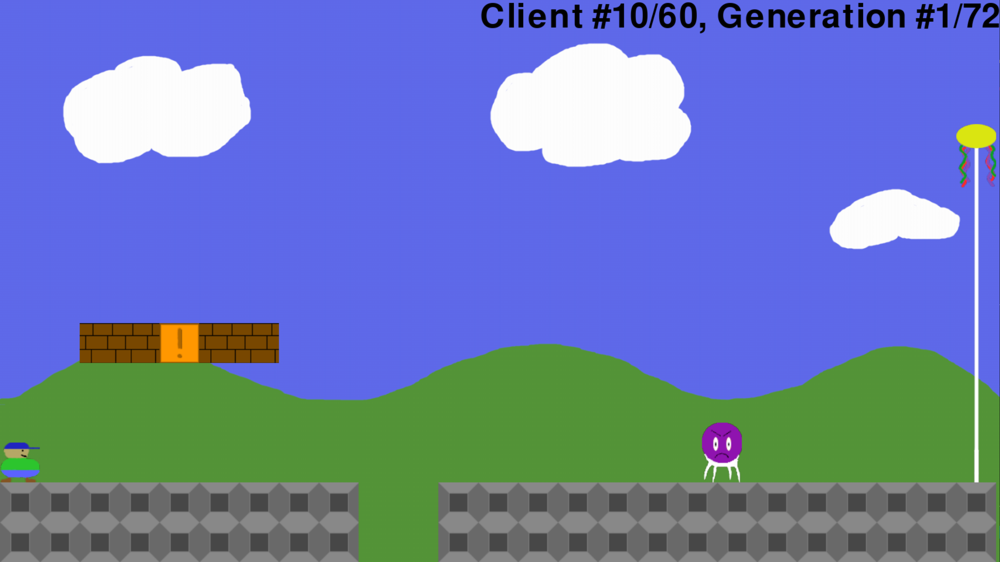

# AI-Platformer-Project

## Description
This application allows the user to train an AI model to complete a level of a Mario-like platformer. Users can create levels, and then train models on these levels. Users can also play their levels themselves if they wish.

  

## Features
* Level creation
* Train AI models using [reinforcement learning](https://en.wikipedia.org/wiki/Reinforcement_learning) or the [NEAT algorithm](https://en.wikipedia.org/wiki/Neuroevolution_of_augmenting_topologies)
* Play your own levels, or have a trained AI model play them for you

## Config
To edit training parameters, open `config.py` in a text editor and make desired changes

## How to Run
Requires Python version 3.10 or higher

From main directory: `pip install -r requirements.txt`

Then run: `python main.py`
